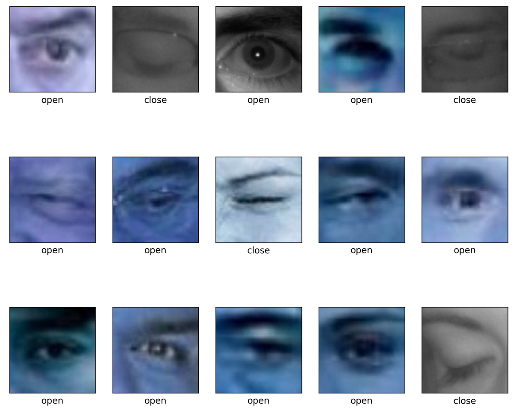
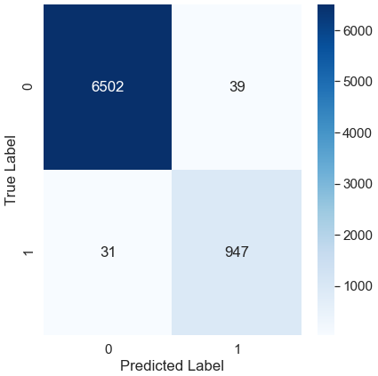

# Drowsiness Detection Using a Convolutional Neural Network
**Jennifer Brown, Andrea Pascale,   
Dustin Stewart, Tenzin Wangdu** 

April 12, 2021

### Problem
---
Drowsy driving results in thousands of deaths and injuries every year. The purpose of this project is to develop a neural network that can detect if eyes are closed, and when applied in tandem with computer vision, to detect if a live human has had their eyes closed for more than a second. This technology would be useful for drivers & owners of commercial vehicles and trains, as well as anybody interested in increased driving safety, including everyday drivers, car companies, and vehicle-insurance companies.

### Background
---
The National Highway Traffic Safety Administration estimates that there are 91,000 crashes involving drowsy drivers a year which lead to an estimated 50,000 injuries and nearly 800 deaths.  Additionally, 1 in 24 adult drivers report having fallen asleep at the wheel in the past 30 days. 

Research has found that going more than 20 hours without sleep is the equivalent of having a blood-alcohol concentration of 0.08% – the U.S. legal limit.

Given the dangers of drowsy driving, the necessity of keeping drivers alert cannot be understated.  This project attempts to identify drowsy drivers in real-time and then provide alerts to ensure they stay awake.

### Table of Contents
---
- [Data Acquisition](code/01_Data_Acquisition_Cleaning.ipynb)
- [Model Development](code/02_Model_Development.ipynb)
- [Final Model](code/03_Final_Model.ipynb)
- [Live Drowsiness Detection](code/04_Webcam_Application.ipynb)  
  - [Summary of Development](code/04_Webcam_Application.ipynb)
  - [Run the Application Locally Using Script](webcam_script)

### Data
---

- A [*Kaggle Dataset*](https://www.kaggle.com/prasadvpatil/mrl-dataset) containing professionally taken close up images of 2,000 open and 2,000 closed eyes.
- The "[*Closed Eyes in the Wild*](http://parnec.nuaa.edu.cn/_upload/tpl/02/db/731/template731/pages/xtan/ClosedEyeDatabases.html)" dataset from Nanjing University of Aeronautics and Astronautics containing 1,192 full face photos of people with both eyes closed.
- "[*Labeled Faces in the Wild*](http://vis-www.cs.umass.edu/lfw/)" from the University of Massachusetts at Amherst with 5,749 full face photos of people with both eyes open.

### Modeling
---
* Convolutional Neural Network to train the model
* Our primary metric was the Precision-Recall Area under the Curve score (PR AUC). The “baseline” score for this metric is 0.5 for both precision and recall, and in a perfect classifier it is 1.
* The PR AUC score is ideal for when classes in the data are heavily imbalanced, such as in the case of this project and places the most importance on how well we predict true positives (a driver is asleep), which is more important to us than predicting true negatives (a driver is awake). The area under the curve represents the proportion of true positives to false positives and false negatives.
# 

### Live Drowsiness Detection
---
* Computer Vision enables us to use a webcam to capture video in real time
* We re-purposed the eye-cropper functions from earlier in the model to process each frame in the video as an image. That cropped image is run through a lightened production model of our neural network and predictions are made.
* When the eye is closed for 6 consecutive frames (around 1.5 seconds), a loud alert is generated to the user to wake them up
* The development process and installation information for the webcam application is located [here](code/04_Webcam_Application.ipynb) and the actual folder containing the files needed to run the application locally are contained [here](webcam_script).

### Overall Conclusions
---
* Neural Networks are a promising area of machine learning model for decreasing accidents due to drowsiness.
* The model built was reliable and by optimizing the video input, this could very well be used in real life applications. Even so, the current webcam application is able to alert the user very effectively and within a couple milliseconds of reaching the closed eye time threshold. 
* Increasing convolutional layers can be effective up to a point, but the dense layers can still be the difference maker by increasing layers or number of neurons. 
* Ethical Considerations:
  - Factories or commercial vehicle companies could use it as a way to overwork employees, rather than give them proper rest
  - Drivers may rely on being awoken by the alert and feel more comfortable driving while drowsy, but even an alert 1 second after falling asleep could be too late to prevent a crash
  
Overall, this project can be deemed a success. We created a model that can reliably predict whether a live human's eyes are closed, and that was our ultimate goal. There are some areas for improvement and we discuss them in the section below.

### Areas for Further Research
---
* Low Light conditions, accounting for other passengers
* Additional test data for closed eyes
* Image augmentation like rotated or flipped images
* Deployment of app to remote server
